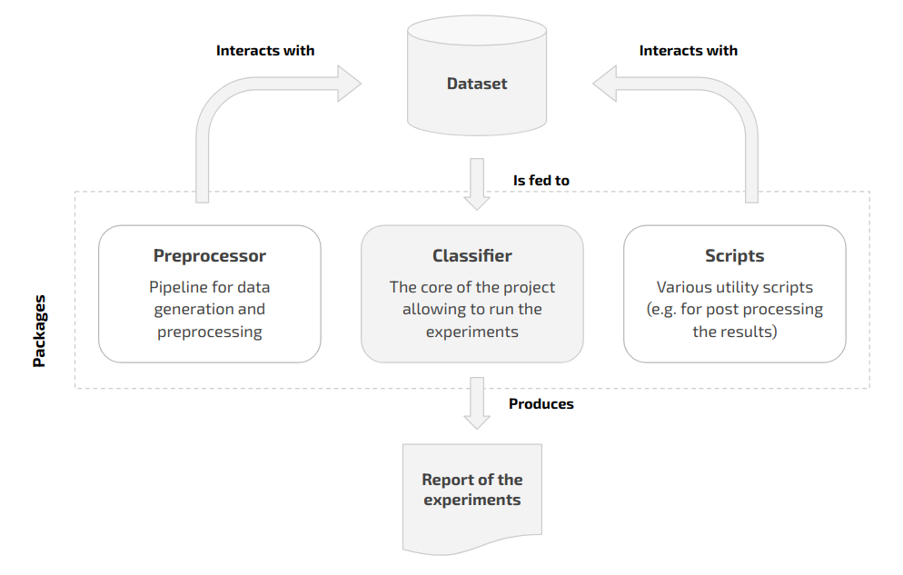

# Neural Networks for binary classification on multiple data modalities

 This project is meant to be an extensible PyTorch framework to experiment with various neural-networks-based deep learning algorithms on multiple data modalities.

## Main features

* **Dynamic multi-modal architectures**. The user is offered off-the-shelf and easy-to-combine basic architectures (e.g. CNN, GRU, etc…) for multimodal approaches to binary classification tasks;
* **Structured experiments**. possibility of running multiple reproducible iterations of CV using different random seeds or metadata and generating detailed reports (including metrics, plots and preds);
* **Data management**. Ready-to-use grouped data split for K-fold and Leave One Out CV, generated anew or based on metadata;
Ease of extension. Clear extension points and easy customisation of the software for different use cases.

## Structure of the project

The project is structured around the following main high-level packages:

* `classifier`. Stores the code related to the core of the project, including the fundamental classes handling the dataset and the training and evaluation of the models as well as the NN architectures;
* `preprocessing`. A pipeline-structured utility that allows for the generation and preprocessing of the data. For instance, image representations of eye-tracking data can be produced from the corresponding sequences, while the latter need to be adjusted and polished before being fed to a NN;
* `scripts`. Various utility scripts are included for postprocessing the results (e.g. aggregating the scores produced by multiple iterations of CV).

The relationship and interaction among the the main packages is summarised by the following scheme.

