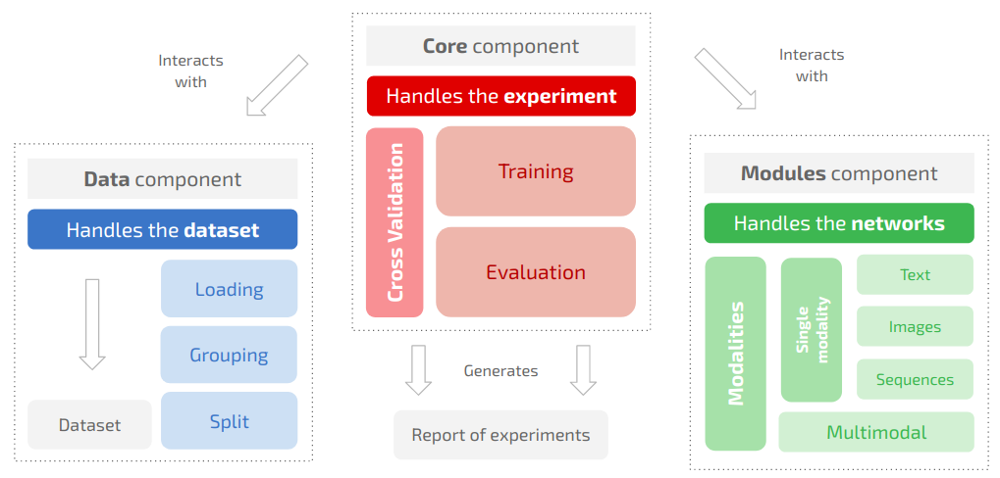
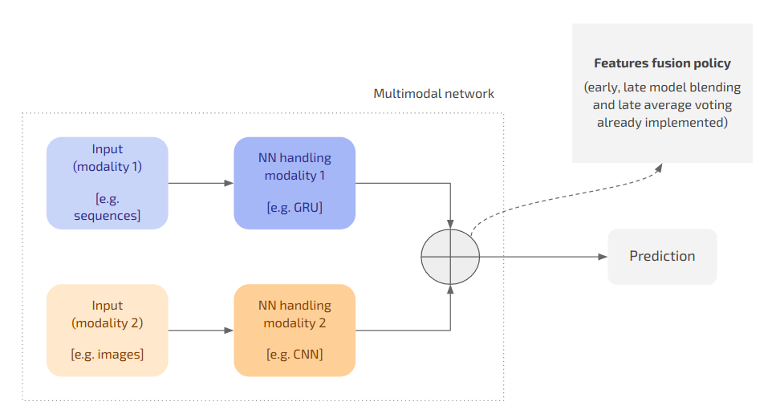
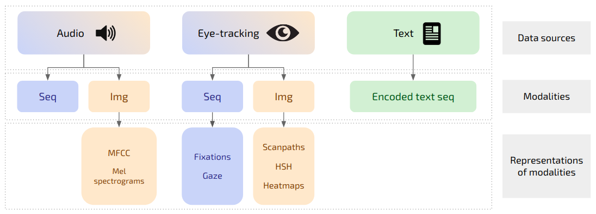

# Classifier

This code is part of the project “Neural Networks for binary classification on multiple data modalities”. This is the core of the project, including the fundamental classes which handle the datasets and the training and evaluation of the models as well as the network architectures.

[TOC]

## General description

The relationship and interaction among the main components of the `classifier` package is summarised by the following scheme.



### Components

#### Core

The **core** component runs an experiment, which is a series of cross validation procedures. It interacts with data and networks-related classes to fetch the data from the dataset and to train the model respectively. The main classes of the package are:

* `Trainer`: receives the `training_params` saved in the `experiment.json` file and handles the training of the model; 
* `Evaluator`: evaluates the model computing the reported metrics; 
* `Model`: takes care of predictions and weight update and is sub classed by each new module. 

#### Modules

Modules consist of two parts:

* A *network* (sub classing torch `nn.Module`) defining the architecture of the NN and its forward phase (e.g. `GRU(nn.Module)`)
* A *model* (sub classing the base `Model` in the core component) the defining how the input is fed to the network for the prediction (e.g. `ModelGRU(Model)`)

They can either handle:

* *Single modalities* (e.g. text as in BERT), or
* *Multiple modalities* (e.g. eye-tracking sequences and images as in the VisTempNet).

Multi modal networks must sub class the base `MultimodalNetwork` stored at `modules/base/networks`. Networks handling multiple modalities are built combining sub modules (i.e. networks handling single modalities, e.g. VisTempNet = CNN + GRU) according to a features fusion policy (i.e. early fusion, late model blending, etc…) as exemplified by the following scheme. 



#### Data

The data component handles:

* Data grouping for each dataset;
* Data loading for each modality;
* Data split for K-Fold and Leave One Out CV.

### Dataset

In order to be used together with this project, a dataset must follow a precise structure:

1. The data items are grouped by **modality**. The currently supported modalities are:

   * *Sequences*: time-series;

   * *Images*: any image representation;

   * *Text*: properly encoded depending on the network processing it.

2. Each modality may have one or mode **data sources** (e.g. the images may have two data sources: audio and eye-tracking;

3. Each data source may have one ore mode **representations** (e.g. the eye-tracking images may be either scan-paths or heatmaps). 

The following scheme exemplifies the relationship among modalities, data sources and representations.

 

The dataset must also contain:

* A `metadata` folder where a `dataset.csv` file summarising the information about the data is dynamically generated;
* A `split` folder containing the metadata for the cross validation and where the data split is dynamically generated.

The metadata for generating the splits are CSV files stating which items belong to each set in each split and where each row correspond to a CV split. The metadata must be structured as follows:

```csv
train_pos , train_neg , test_pos  , test_neg
EO-083 ..., HE-099 ..., EA-084 ..., HP-138 ...
EO-091 ..., HA-113 ..., EE-190 ..., HH-055 ...
...
```

The general structure of a compatible dataset is the following:

```shell
├── metadata
├── modalities
│   ├── modality_1
│   │   └── data_source_1 [optional]
│   │   |   ├── representation_1
│   │   |   │   └── base
│   │   |   │	|   ├── 0_neg_label
│   │   |   │   |   └── 1_pos_label
│   │   |   │   └── augmented
│   │   |   │       ├── 0_neg_label
│   │   |   │       └── 1_pos_label
|	|	|	|
│   │   |   |	...
|	|	|	|
|	|	|	└── representation_N
│   │   └── data_source_N [optional]
|	| 	
|	| 	...
|	| 	
|	└── modality_N
└── split
    ├── folds [dynamically generated]
    │   ├── fold_1
    |	|
    |	|	...
    |	|
    │   └── fold_N
    └── metadata
```

For example:

```
├── metadata
├── modalities
│   ├── audio
│   ├── images
│   │   └── eye_tracking
│   │       ├── heatmaps
│   │       │   └── base
│   │       │       ├── 0_healthy
│   │       │       └── 1_alzheimer
│   │       └── scan_paths
│   │       	└── augmented
│   │               ├── 0_healthy
│   │               └── 1_alzheimer
│   ├── sequences
│   │   ├── audio
│   │   │   ├── augmented
│   │   │   │   ├── 0_healthy
│   │   │   │   └── 1_alzheimer
│   │   │   └── base
│   │   │       ├── 0_healthy
│   │   │       └── 1_alzheimer
│   │   └── eye_tracking
│   │       ├── augmented
│   │       │   ├── 0_healthy
│   │       │   └── 1_alzheimer
│   │       └── base
│   │           ├── 0_healthy
│   │           └── 1_alzheimer
│   └── text
│       └── base
│           ├── 0_healthy
│           └── 1_alzheimer
└── split
    └── metadata
```

## Requirements

The code is based on PyTorch and can run both on CPU and GPU supporting CUDA. In order to run the software, one must install the requirements listed in the `requirements.txt` file. The code has been tested using PyTorch 1.4.0.

## Configuration of the experiment

In order to run an experiment, one has to manually edit the configuration JSON files (stored in `params`) related to core aspects of the experiment itself. The core aspects of an experiments are the following:

1. **Experimental setting** (`experiment.json`): selection of the network architecture and of dataset and parameters related to the the training procedure;
2. **Cross validation** (`cross_validation.json`): selection of the type of cross validation to be performed and whether or not to regenerate the data split;
3. **Network** (`networks/`): architecture-specific parameters for the selected networks (or for the sub modules in case of multi-modal architectures);
4. **Dataset** (`dataset/`): paths to the data modalities involved in the experiment and selection of the main modality;
5. **Modality** (`modalities/`):  modality-specific parameters for the modalities handled by the selected network. 

### Experimental setting

These parameters define the general setting of the experiments and the configuration for the training procedure.

#### Description of the parameters

##### General

| Name           | Type  | Values                                                       | Description                                                  |
| -------------- | ----- | ------------------------------------------------------------ | ------------------------------------------------------------ |
| `id`           | `str` | Any string including the empty string                        | An optional ID for the experiment which the folder reporting the results will be named after (including a timestamp at the tail). If the empty string is provided then the ID defaults to `[dataset_type]_[validation_type]_[network_type]_[timestamp]`. |
| `device`       | `str` | `cpu` or a string matching the regex `\bcuda:\b\d+`          | The device to be used when performing the training procedure. If a selected CUDA device is not available, defaults to CPU. |
| `dataset_type` | `str` | Any dataset name having corresponding parameters in the `params/dataset/` folder | The dataset to be used to train and evaluate the model.      |
| `network_type` | `str` | Any network name having corresponding parameters in the `params/networks/` folder | The network to be used to train and evaluate the model.      |
| `num_seeds`    | `int` | Any positive integer number                                  | The number of different random seeds for which the CV procedure on each selected split must be run. The random seeds are generated increasing the `base_seed` by one unit at a time (e.g. `num_seed = 3` and `base_seed = 1` implies seeds ranging from 1 to 3 included). |
| `base_seed`    | `int` | Any integer number                                           | The base random seed value increased by one unit at a time for `num_seeds` times. |

##### Training

| Name            | Type   | Values                                                       | Description                                                  |
| --------------- | ------ | ------------------------------------------------------------ | ------------------------------------------------------------ |
| `epochs`        | `int`  | Any positive integer number                                  | The maximum number of epochs (i.e. iterations through the whole dataset) to be performed. |
| `optimizer`     | `str`  | Any optimiser name implemented in `classes/factories/OptimizerFactory` | The type of optimiser to be used. for updating the weights.  |
| `criterion`     | `str`  | Any criterion name implemented in `classes/factories/CriterionFactory` | The loss criterion to be used for approximating the error.   |
| `clip_gradient` | `bool` | Any Boolean value                                            | Whether or not to clip the gradient (using a normalisation strategy) during the update of the weights |
| `batch_size`    | `int`  | Any positive integer number greater than zero                | The size of the mini-batches                                 |

###### Early stopping

| Name            | Type   | Values                                                       | Description                                                  |
| --------------- | ------ | ------------------------------------------------------------ | ------------------------------------------------------------ |
| `active`        | `bool` | Any positive integer number greater than zero                | Whether or not to use early stopping. If set to `false`, the training procedure stops after the selected number of epochs. |
| `patience`      | `int`  | Any positive integer number greater than zero                | The number of iterations for which a non-improvement of the monitored metrics is tolerated. |
| `log_every`     | `int`  | Any positive integer number greater than zero                | The frequency (in terms of epochs) with which the metrics should be logged on terminal. |
| `metrics`       | `str`  | Any metrics name from those implemented in `classes/core/Evaluator.py ` | The monitored validation metrics (e.g. `auc`, `f1`, `loss`, etc…) |
| `metrics_trend` | `str`  | `increasing` or `decreasing`                                 | Whether the monitored metrics is supposed to increase or decrease (e.g. `auc` should increase while `loss` should decrease). |

###### Learning rate

| Name                   | Type    | Values                                        | Description                                                  |
| ---------------------- | ------- | --------------------------------------------- | ------------------------------------------------------------ |
| `initial_value`        | `float` | Any positive float number greater than zero   | The learning rate value the optimiser should initialised to. |
| `decay_ratio`          | `float` | Any positive integer number greater than zero | The number by which the learning rate should be multiplied on decay. |
| `decay_patience`       | `int`   | Any positive integer number greater than zero | The number of iterations for which a non-improvement of the monitored metrics is tolerated before decaying the learning rate. In order not to use the learning rate decay it is sufficient to set this value to a number which is higher than the patience of the early stopping. |
| `max_decreases`        | `int`   | Any positive integer number greater than zero | The maximum number of times the learning rate decay should be applied. After that number has been reached, the learning rate will not be decreased any further. |
| `reload_best_on_decay` | `bool`  | Any Boolean value                             | Whether or not to reload the best model after decaying the learning rate. |

#### Example

```json
{
  "id": "10_iterations_cnn_scan_paths_augmented_1",
  "device": "cuda:3",
  "dataset_type": "alzheimer",
  "network_type": "cnn",
  "num_seeds": 1,
  "base_seed": 1,
  "training": {
    "epochs": 100,
    "optimizer": "AdamW",
    "criterion": "CrossEntropyLoss",
    "clip_gradient": true,
    "batch_size": 256,
    "early_stopping": {
      "active": true,
      "patience": 15,
      "log_every": 1,
      "metrics": "auc",
      "metrics_trend": "increasing"
    },
    "learning_rate": {
      "initial_value": 1e-5,
      "decay_ratio": 0.5,
      "decay_patience": 20,
      "max_decreases": 3,
      "reload_best_on_decay": true
    }
  }
}
```

### Cross validation

These parameters define how the cross validation should be performed and whether or not to reload preexisting data.

#### Description of the parameters

##### General

| Name              | Type    | Values                                                     | Description                                                  |
| ----------------- | ------- | ---------------------------------------------------------- | ------------------------------------------------------------ |
| `type`            | `str`   | `k_fold` or `leave_one_out`                                | The type of CV to be performed, either K-fold CV or Leave One Out CV. |
| `folds_type`      | `str`   | `dataset` or `training`                                    | Whether to split into folds the the training set (training + validation), thus using always the same test set, or the whole dataset. |
| `k`               | `int`   | Any positive integer number greater than zero (usually 10) | The number of folds which the dataset must be split into.    |
| `validation_size` | `float` | Any positive float number between zero and one             | The percentage of items to be included in the validation set (with respect to the training set). |
| `test_size`       | `float` | Any positive float number between zero and one             | The percentage of items to be included in the test set (with respect to the whole dataset). |
| `downscale`       | `bool`  | Any Boolean value                                          | Whether or not to downscale the validation set to have the same amount of items in the majority class as the training set. |
| `plot_metrics`    | `bool`  | Any Boolean value                                          | Whether or not to save the plot of the metrics during training. |
| `force_deletion`  | `bool`  | Any Boolean value                                          | Whether or not to ask forcefully delete the stored split. If set to `true`, the user will not be prompted for confirmation when the deleting the current split. |
| `use_cv_metadata` | `bool`  | Any Boolean value                                          | Whether or not to use metadata information for the split instead of generating it anew. |

##### Reload split

| Name            | Type   | Values            | Description                                                  |
| --------------- | ------ | ----------------- | ------------------------------------------------------------ |
| `training_test` | `bool` | Any Boolean value | When the dataset is split using `folds_type = “training”`, it is first split into training and test set and then the training set is split into `k` folds. This parameter states whether or not this split should be reloaded. |
| `folds`         | `bool` | Any Boolean value | Whether or not to reload the previously generated folds.     |

#### Example

```json
{
  "type": "k_fold",
  "folds_type": "dataset",
  "k": 10,
  "validation_size": 0.1,
  "test_size": 0.1,
  "downscale": false,
  "plot_metrics": true,
  "force_deletion": true,
  "use_cv_metadata": true,
  "save_split_metadata": false,
  "reload_split": {
    "training_test": false,
    "folds": false
  }
}
```

### Dataset

#### Description of the parameters

##### General

| Name                  | Type   | Values            | Description                                                  |
| --------------------- | ------ | ----------------- | ------------------------------------------------------------ |
| `variable_size_input` | `bool` | Any Boolean value | Whether or not the input data features variable input size. If set to `true`, a custom `collate_fn` will be used for the data loader allowing for variable sized inputs. |

##### Classes

| Name       | Type  | Values                          | Description                                                  |
| ---------- | ----- | ------------------------------- | ------------------------------------------------------------ |
| `positive` | `str` | Any string but the empty string | The ID of the positive class. It must be the same as the name of the folder containing the positive data items (without the `1_` prefix). |
| `negative` | `str` | Any string but the empty string | The ID of the negative class. It must be the same as the name of the folder containing the negative data items (without the `0_` prefix). |

##### Paths

| Name               | Type  | Values                          | Description                                                  |
| ------------------ | ----- | ------------------------------- | ------------------------------------------------------------ |
| `dataset_folder`   | `str` | Any string but the empty string | The path to the main datasets folder (containing all the datasets, including the one whose parameters are being set in the present configuration file). |
| `dataset_metadata` | `str` | Any string but the empty string | The path to the folder containing general metadata for the specific dataset. |
| `cv_metadata`      | `str` | Any string but the empty string | The path to the folder containing CV-splits-related metadata for the specific dataset. |

###### Modalities

| Name        | Type  | Values                          | Description                                                  |
| ----------- | ----- | ------------------------------- | ------------------------------------------------------------ |
| `images`    | `str` | Any string but the empty string | The path to the folder containing the data related to the `images` modality. |
| `sequences` | `str` | Any string but the empty string | The path to the folder containing the data related to the `sequences` modality. |
| `text`      | `str` | Any string but the empty string | The path to the folder containing the data related to the `text` modality. |
| `audio`     | `str` | Any string but the empty string | The path to the folder containing the data related to the `audio` modality. |

#### Example

File `alzheimer.json` with respect to the Alzheimer dataset stored at `../dataset/alzheimer`.

```json
{
  "variable_size_input": false,
  "classes": {
    "positive": "alzheimer",
    "negative": "healthy"
  },
  "paths": {
    "dataset_folder": "../dataset",
    "dataset_metadata": "metadata",
    "cv_metadata": "split/metadata/eye_tracking/5_1",
    "modalities": {
      "images": "images",
      "sequences": "sequences",
      "text": "text",
      "audio": "audio"
    }
  }
}
```

### Modalities

#### Sequences

| Name                | Type   | Values                                 | Description                                                  |
| ------------------- | ------ | -------------------------------------- | ------------------------------------------------------------ |
| `type`              | `str`  | Any string                             | The type of sequences to be used. This must match with the name of a folder inside the corresponding `data_source` in the dataset. |
| `data_source`       | `str`  | Any string                             | The type of data source the sequences are fetched from. This must match with the name of a folder inside `modalities/sequences` in the dataset. |
| `file_format`       | `str`  | Any string but the empty string        | The file format of the data items (e.g. `pkl`, `csv`, etc…). |
| `num_features`      | `int`  | Any positive integer greater than zero | The number of features to be used. Features are selected sequentially from the features at position 0. |
| `normalize`         | `bool` | Any Boolean value                      | Whether or not to perform batch-wise L2 normalisation        |
| `augment`           | `bool` | Any Boolean value                      | Whether or not to use *augmented* sequences instead of *base* (i.e. non-augmented) sequences. |
| `length`        | `int`  | Any positive integer greater than zero | The target length of the truncated sequences.                |
| `truncate_from`     | `str`  | Either `head` or `tail`                | The starting point for the truncation of the sequence. |
| `truncation_offset` | `int`  | Any non-negative integer               | The number of time steps to skip with respect to the starting point of the truncation of the sequence. |

#### Images

| Name           | Type   | Values                          | Description                                                  |
| -------------- | ------ | ------------------------------- | ------------------------------------------------------------ |
| `type`         | `str`  | Any string                      | The type of images to be used. This must match with the name of a folder inside the corresponding `data_source` in the dataset. |
| `data_source`  | `str`  | Any string                      | The type of data source the sequences are fetched from. This must match with the name of a folder inside `modalities/images` in the dataset. |
| `file_format`  | `str`  | Any string but the empty string | The file format of the data items (e.g. `png`, `jpg`, etc…). |
| `augment`      | `bool` | Any Boolean value               | Whether or not to use *augmented* images instead of *base* (i.e. non-augmented) images. |
| `num_channels` | `int`  | Any integer in {1, 2, 3}        | The number of channels to be considered for the input images (e.g. 1 for black-and-white, 3 for RGB, etc…). |

##### Size

| Name     | Type  | Values                   | Description                                           |
| -------- | ----- | ------------------------ | ----------------------------------------------------- |
| `width`  | `int` | Any non-negative integer | The width which the input images will be resized to.  |
| `height` | `int` | Any non-negative integer | The height which the input images will be resized to. |

#### Text

| Name                             | Type   | Values                                                       | Description                                                  |
| -------------------------------- | ------ | ------------------------------------------------------------ | ------------------------------------------------------------ |
| `file_format`                    | `str`  | Any string but the empty string                              | The file format of the data items (e.g. `txt`).              |
| `augment`                        | `bool` | Any Boolean value                                            | Whether or not to use *augmented* text instead of *base* (i.e. non-augmented) text. |
| `max_sentences`                  | `int`  | The dataset-specific maximum number of sentences in a document | The dataset-specific maximum number of sentences in a document. |
| `max_words`                      | `int`  | The dataset-specific maximum number of words in a sentence   | The dataset-specific maximum number of words in a sentence.  |
| `vocabulary_size`                | `int`  | The dataset-specific size of the vocabulary                  | The dataset-specific size of the vocabulary.                 |
| `embedding_size`                 | `int`  | Any non-negative integer                                     | The desired size for the word embedding (usually 300).       |
| `use_pre_trained_embeddings`     | `bool` | Any Boolean value                                            | Whether or not to use pretrained word embeddings.            |
| `path_to_pre_trained_embeddings` | `str`  | Any string                                                   | A local path to some pretrained word embeddings.             |

## Report of the experiments

Results of experiments are saved in a user-named folder. The results are nested by seed and iteration and include, for each fold:

* Training, validation and test metrics;
* Training, validation and test plots of metrics over epochs;
* Training, validation and test predictions

All the parameters involved in the experiment are dumped into the main folder of the report. These are stored in three files:

1. `data.json`: data-related parameters such as dataset parameters (including name and main modality used for the experiment);
2. `experiment_setting`: general configuration of the experiment included in the `experiment.json` configuration file;
3. `network_params`: network-related parameters and configuration for the corresponding modality.

## Implemented architectures

### RNN

> Reference: https://stanford.edu/~shervine/teaching/cs-230/cheatsheet-recurrent-neural-networks

A Recurrent Neural Network (RNN) is a class of neural networks where connections between nodes form a directed graph along a temporal sequence. RNNs allow previous outputs to be used as inputs while having hidden states. This makes it possible to exhibit temporal dynamic behaviour, thus RNN models are mostly used in the fields of natural language processing and speech recognition. 


The vanishing and exploding gradient phenomena are often encountered in the context of RNNs. The reason why they happen is that it is difficult to capture long term dependencies because of multiplicative gradient that can be exponentially decreasing/increasing with respect to the number of layers. Gradient clipping is a technique used to cope with the exploding gradient problem sometimes encountered when performing backpropagation. By capping the maximum value for the gradient, this phenomenon is controlled in practice. Gated Recurrent Unit (GRU) and Long Short-Term Memory units (LSTM) deal with the vanishing gradient problem encountered by traditional RNNs, with LSTM being a generalisation of GRU.

The principle of Bidirectional RNN (BRNN) is to split the neurons of a regular RNN into two directions, one for positive time direction (forward states), and another for negative time direction (backward states). Those two states’ output are not connected to inputs of the opposite direction states. By using two time directions, input information from the past and future of the current time frame can be used unlike standard RNN which requires the delays for including future information.


#### LSTM

> Reference: https://en.wikipedia.org/wiki/Long_short-term_memory

Long short-term memory (LSTM) is an artificial recurrent neural network (RNN) architecture which, unlike feed forward neural networks, has feedback connections. It can not only process single data points (such as images), but also entire sequences of data (such as speech or video). A common LSTM unit is composed of a cell, an input gate, an output gate and a forget gate. The cell remembers values over arbitrary time intervals and the three gates regulate the flow of information into and out of the cell.

In theory, classic (or "vanilla") RNNs can keep track of arbitrary long-term dependencies in the input sequences. The problem of vanilla RNNs is computational (or practical) in nature: when training a vanilla RNN using back-propagation, the gradients which are back-propagated can "vanish" (that is, they can tend to zero) or "explode" (that is, they can tend to infinity), because of the computations involved in the process, which use finite-precision numbers. RNNs using LSTM units partially solve the vanishing gradient problem, because LSTM units allow gradients to also flow unchanged. However, LSTM networks can still suffer from the exploding gradient problem.

There are several architectures of LSTM units. A common architecture is composed of a cell (the memory part of the LSTM unit) and three "regulators", usually called gates, of the flow of information inside the LSTM unit: an input gate, an output gate and a forget gate. Some variations of the LSTM unit do not have one or more of these gates or maybe have other gates. For example, gated recurrent units (GRUs) do not have an output gate.

Intuitively, the cell is responsible for keeping track of the dependencies between the elements in the input sequence. The input gate controls the extent to which a new value flows into the cell, the forget gate controls the extent to which a value remains in the cell and the output gate controls the extent to which the value in the cell is used to compute the output activation of the LSTM unit. The activation function of the LSTM gates is often the logistic sigmoid function.

There are connections into and out of the LSTM gates, a few of which are recurrent. The weights of these connections, which need to be learned during training, determine how the gates operate.


#### GRU

> Reference: https://en.wikipedia.org/wiki/Gated_recurrent_unit

Gated recurrent units (GRUs) are a gating mechanism in recurrent neural networks. The GRU is like a long short-term memory (LSTM) with a forget gate but has fewer parameters than LSTM, as it lacks an output gate. The performance of GRU on certain tasks was found to be similar to that of LSTM. GRUs have been shown to exhibit even better performance on certain smaller and less frequent datasets.

 

### CNN

> Reference: https://stanford.edu/~shervine/teaching/cs-230/cheatsheet-convolutional-neural-networks

Convolutional Neural Networks (CNNs), are a specific type of neural networks that are generally composed of the following layers:

* **Convolution layer.** The convolution layer uses filters that perform convolution operations as it is scanning the input I with respect to its dimensions. Its hyper parameters include the filter size F and stride S. The resulting output O is called feature map or activation map. The convolution step can be generalised to the 1D and 3D cases as well.
* **Pooling.** The pooling layer is a down sampling operation, typically applied after a convolution layer. In particular, max and average pooling are special kinds of pooling where the maximum and average value is taken, respectively.
* **Fully Connected.** The Fully Connected (FC) layer operates on a flattened input where each input element is connected to all neurons. If present, FC layers are usually found towards the end of CNN architectures and can be used to optimise objectives such as class scores.

#### Pretrained CNN

Pretrained CNNs feature a model which has previously been trained on a very large dataset to either extract useful features from the input or perform standard classification. In the former case, the parameters of the pretrained model will not be updated during the training procedure.

### CNNRNN

> Reference: https://machinelearningmastery.com/cnn-long-short-term-memory-networks/

The CNNRNN is an RNN architecture specifically designed for sequence prediction problems with spatial inputs, like images or videos. The CNNRNN architecture involves using Convolutional Neural Network (CNN) layers for feature extraction on input data combined with RNNs to support sequence prediction. CNNRNNs were developed for visual time series prediction problems and the application of generating textual descriptions from sequences of images (e.g. videos). In this project, a CNNRNN architecture is used for both image and sequence classification. In the former case, the intuition is leveraging the sequential nature of 1D plots such as spectrograms whose features are summarised by the convolution process. In the latter case, the idea is projecting very long sequences in a lower dimensional space using convolution and then feeding them to an RNN.     

### Transformer

> Reference: https://en.wikipedia.org/wiki/Transformer_(machine_learning_model)

Like recurrent neural networks (RNNs), Transformers are designed to handle sequential data, such as natural language, for tasks such as translation and text summarization. However, unlike RNNs, Transformers do not require that the sequential data be processed in order. For example, if the input data is a natural language sentence, the Transformer does not need to process the beginning of it before the end. Due to this feature, the Transformer allows for much more parallelization than RNNs and therefore reduced training times.

The Transformer is an encoder-decoder architecture. The encoder consists of a set of encoding layers that processes the input iteratively one layer after another and the decoder consists of a set of decoding layers that does the same thing to the output of the encoder.

The function of each encoder layer is to process its input to generate encodings, containing information about which parts of the inputs that are relevant to each other. It passes its set of encodings to the next encoder layer as inputs. Each decoder layer does the opposite, taking all the encodings and processes them, using their incorporated contextual information to generate an output sequence. To achieve this, each encoder and decoder layer makes use of an attention mechanism, which for each input, weighs the relevance of every other input and draws information from them accordingly to produce the output. Each layer decoder also has an additional attention mechanism which draws information from the outputs of previous decoders, before the decoder layer draws information from the encodings. Both the encoder and decoder layers have a feed-forward neural network for additional processing of the outputs, and contain residual connections and layer normalisation steps.

### HAN

> Reference: https://www.cs.cmu.edu/~./hovy/papers/16HLT-hierarchical-attention-networks.pdf

Hierarchical Attention Networks (HANs) are NN architectures proposed for document classification tasks which have two distinctive characteristics:

1. A hierarchical structure that mirrors the hierarchical structure of documents;
2. Two levels of attention mechanisms applied at the word and sentence-level, enabling it to attend deferentially to more and less important content when constructing the document representation.

## Extending the code

> Reference: https://en.wikipedia.org/wiki/Factory_method_pattern

### Adding a new dataset

The procedure to add a new dataset is the following:

1. **Creating the dataset ID**. Each new dataset is associated to a unique ID (e.g. Alzheimer >> `alzheimer`) to allow for it to be referenced in the configuration of the experiment. New datasets must be included in the `dataset` folder in a subdirectory named after their IDs (e.g. Alzheimer >> `dataset/alzheimer/...`). Note that case sensitivity matters;
2. **Structuring the dataset**. The dataset must be structured as described at *§ General description - Dataset* in this document;
2. **Defininig the grouper**. Each dataset must be coupled with a specific class defining its data grouping policy within the splits for the cross-validation (e.g. group patients by subtasks or by cyclic split). This class must be defined at `classes/data/groupers` and must subclass `DataGrouper`. 

### Adding a new modality

Each new modality is associated to a unique ID (e.g. sequences >> `sequences`) to allow for it to be referenced in the configuration of the experiment. New modalities must be included in the `dataset/specific_dataset/modalities` folder and may include specific data sources and representation. The procedure to add a new modality is the following:

1. Move the data at `dataset/specific_dataset/modalities/new_modality` making sure the folder is structured as described at *§ General description - Dataset* in this document;
2. Write a new data loader at `classes/data/loaders` defining how the data items belonging to the new modality must be loaded (note that the new class must sub class `data.Loader` ;
3. Update the `factories.LoaderFactory` inserting a new key value pair in the corresponding map binding the ID of the modality to its loader;
4. Write a new file named as the ID of the modality including the modality-specific parameters.

### Adding a new network

Each module is associated to an ID that allows for it to be referenced in the configuration of the experiment (e.g. Hierarchical Attention Network >> `han`). To add a new network, a new module must be defined. Modules are stored at `classes/modules` and include two classes:

1. The network class defining the architecture of the network and its forward phase (i.e. a sub class of `nn.Module`);
2. The model class defining how the network is instantiated an how the inputs are fed to it. This must sub class `classes.core.Model`.

Note that the constructor of the network classes must have the following signature:

```python
def __init__(network_params: dict, activation: bool)
	"""
	@param network_params: dictionary contatining both the parameters listed in the configuration file of the module and the parameters listed in the configuration file of the corresponding modality
    @param activation: whether or not the architecture will feature classification layers (set to None for implementing some features fusion policies in multimodal networks)
	"""
```

After writing the new module, the following factories must be updated inserting a new key value pair in the corresponding map:

* `factories.ModelFactory`, binding the ID of the new module to the corresponding model;
* `factories.NetworkFactory`, binding the ID of the new module to the corresponding network.

Next, the new module must be bounded to a modality (or to multiple modalities in case of multi modal networks). This can be done updating the corresponding map at `binders.ModalityBinder`.

Finally, the module can be configured either:

* Using a preexisting  JSON file at `params/networks` binding the two together at `binders.ParamsBinder` , or
* Writing a fresh JSON configuration file for the new module

Note that the binding between the configuration file and the module is optional. If no binding exists, the `binders.ParamsBinder` will search for a configuration file named as the ID of the new module. 

### Adding a new criterion

In order to add a new criterion, `factories.CriterionFactory` must be updated inserting a new key value pair in the corresponding map. This binds the ID of the new criterion to its in-place definition.

### Adding a new optimiser

In order to add a new optimiser, `factories.OptimizerFactory` must be updated inserting a new key value pair in the corresponding map. This binds the ID of the new optimiser to its in-place definition.
