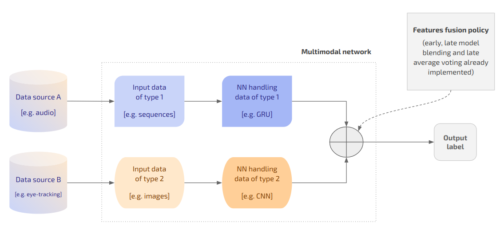

# Classifier

This code is part of the project “Neural Networks for binary classification on multiple data modalities”. The `classifier` package is the core of the project, including the fundamental classes which handle the datasets and the train and evaluation of the models as well as the Neural Networks (NNs) architectures.

## General description

The relationship and interaction among the main components of the `classifier` package is summarised by the following scheme.


### Components

#### Core

The **core** component runs an experiment, which is a series of Cross-Validation (CV) procedures. It interacts with `data` and networks-related classes to fetch the data from the dataset and to train the model respectively. The main classes of the package are:

* `Trainer`: receives the `train_params` saved in the `experiment.json` file and handles the train of the model; 
* `Evaluator`: evaluates the model computing the reported metrics; 
* `Model`: takes care of preds and weight update and is subclassed by each new module. 

#### Modules

Modules consist of two parts:

* A *network* (subclassing torch `nn.Module`) defining the architecture of the NN and its forward phase (e.g. `GRU(nn.Module)`)
* A *model* (subclassing the base `Model` in the core component) defining how the input is fed to the network for the prediction (e.g. `ModelGRU(Model)`)

They can either handle:

* *Single modalities* (e.g. text as in BERT), or
* *Multiple modalities* (e.g. eye-tracking sequences and images as in the VisTempNet).

Multi modal networks must subclass the base `MultimodalNetwork` stored at `modules/base/networks`. Networks handling multiple modalities are built combining submodules (i.e. networks handling single modalities, e.g. VisTempNet = CNN + GRU) according to a features fusion policy (i.e. early fusion, late model blending, etc…) as exemplified by the following scheme. 



#### Data

The data component handles:

* Data grouping for each dataset;
* Data loading for each modality;
* Data split for K-Fold and Leave One Out CV.

### Dataset

In order to be used together with this project, a dataset must follow a precise structure:

1. The data items are grouped by **modality**. The currently supported modalities are:

   * *Sequences*: time-series;

   * *Images*: any image representation;

   * *Text*: word sequences properly encoded depending on the network which is processing them.

2. Each modality may have one or more **data sources** (e.g. the images may have two data sources: audio and eye-tracking;

3. Each data source may have one ore more **representations** (e.g. the eye-tracking images may be either scan-paths or heatmaps). 

The following scheme exemplifies the relationship among modalities, data sources and representations.

 

The dataset must also contain:

* A `metadata` folder where a `dataset.csv` file summarising the information about the data is dynamically generated;
* A `split` folder containing the metadata for the CV and where the data split is dynamically generated.

The metadata for generating the splits are CSV files stating which items belong to each set in each split and where each row correspond to a CV split. The metadata must be structured as follows:

```csv
train_pos , train_neg , test_pos  , test_neg
EO-083 ..., HE-099 ..., EA-084 ..., HP-138 ...
EO-091 ..., HA-113 ..., EE-190 ..., HH-055 ...
...
```

The general structure of a compatible dataset is the following:

```shell
├── metadata
├── modalities
│   ├── modality_1
│   │   └── data_source_1 [optional]
│   │   |   ├── representation_1 [optional]
│   │   |   │   └── base
│   │   |   │	|   ├── 0_neg_label
│   │   |   │   |   └── 1_pos_label
│   │   |   │   └── augmented
│   │   |   │       ├── 0_neg_label
│   │   |   │       └── 1_pos_label
|   |	|   |	
│   │   |   |	...
|   |	|   |	
|   |	|   └── representation_N [optional]
|   |   |
│   │   |   ...
|   |   |
|   |   └── data_source_N [optional]
|   | 	
|   | 	...
|   | 	
|   └── modality_N
└── split
    ├── folds [dynamically generated]
    │   ├── fold_1
    |	|
    |	|	...
    |	|
    │   └── fold_N
    └── metadata
```

For example:

```
├── metadata
├── modalities
│   ├── audio
│   ├── images
│   │   └── eye_tracking
│   │       ├── heatmaps
│   │       │   └── base
│   │       │       ├── 0_healthy
│   │       │       └── 1_alzheimer
│   │       └── scan_paths
│   │       	└── augmented
│   │               ├── 0_healthy
│   │               └── 1_alzheimer
│   ├── sequences
│   │   ├── audio
│   │   │   ├── augmented
│   │   │   │   ├── 0_healthy
│   │   │   │   └── 1_alzheimer
│   │   │   └── base
│   │   │       ├── 0_healthy
│   │   │       └── 1_alzheimer
│   │   └── eye_tracking
│   │       ├── augmented
│   │       │   ├── 0_healthy
│   │       │   └── 1_alzheimer
│   │       └── base
│   │           ├── 0_healthy
│   │           └── 1_alzheimer
│   └── text
│       └── base
│           ├── 0_healthy
│           └── 1_alzheimer
└── split
    └── metadata
```

## Requirements

The code is based on PyTorch and can run both on CPU and GPU supporting CUDA. In order to run the software, one must install the requirements listed in the `requirements.txt` file. The code has been tested using PyTorch 1.4.0.

## Configuration of the experiment

In order to run an experiment, one has to manually edit the configuration JSON files (stored in `params`) related to some core aspects of the analysis. The core aspects of an experiments are the following:

1. **Experimental setting** (`experiment.json`): NN architecture and dataset, parameters related to the the train procedure;
2. **Cross val** (`cross_val.json`): type of CV to be performed and whether or not to regenerate the data split;
3. **Network** (`networks/`): architecture-specific parameters for the selected NN (or for the submodules in case of multi-modal architectures);
4. **Dataset** (`dataset/`): paths to the data modalities involved in the experiment;
5. **Modality** (`modalities/`):  modality-specific parameters for the modalities handled by the selected NN. 

### Experimental setting

These parameters define the general setting of the experiments and the configuration for the train procedure.

#### Description of the parameters

##### General

| Name           | Type  | Values                                                       | Description                                                  |
| -------------- | ----- | ------------------------------------------------------------ | ------------------------------------------------------------ |
| `id`           | `str` | Any string including the empty string                        | An optional ID for the experiment which the folder reporting the results will be named after (including a timestamp at the tail). If the empty string is provided then the ID defaults to `[dataset_type]_[val_type]_[network_type]_[timestamp]`. |
| `device`       | `str` | `cpu` or a string matching the regex `\bcuda:\b\d+`          | The device to be used when performing the train procedure. If a selected CUDA device is not available, defaults to CPU. |
| `dataset_type` | `str` | Any dataset name having corresponding parameters in the `params/dataset/` folder | The dataset to be used to train and evaluate the model.      |
| `network_type` | `str` | Any network name having corresponding parameters in the `params/networks/` folder | The network to be used to train and evaluate the model.      |
| `num_seeds`    | `int` | Any pos integer number                                  | The number of different random seeds for which the CV procedure on each selected split must be run. The random seeds are generated increasing the `base_seed` by one unit at a time (e.g. `num_seed = 3` and `base_seed = 1` implies seeds ranging from 1 to 3 included). |
| `base_seed`    | `int` | Any integer number                                           | The base random seed value increased by one unit at a time for `num_seeds` times. |

##### Training

| Name            | Type   | Values                                                       | Description                                                  |
| --------------- | ------ | ------------------------------------------------------------ | ------------------------------------------------------------ |
| `epochs`        | `int`  | Any pos integer number                                  | The maximum number of epochs (i.e. iterations through the whole dataset) to be performed. |
| `optimizer`     | `str`  | Any optimiser name implemented in `classes/factories/OptimizerFactory` | The type of optimiser to be used. for updating the weights.  |
| `criterion`     | `str`  | Any criterion name implemented in `classes/factories/CriterionFactory` | The loss criterion to be used for approximating the error.   |
| `clip_gradient` | `bool` | Any Boolean value                                            | Whether or not to clip the gradient (using a normalisation strategy) during the update of the weights |
| `batch_size`    | `int`  | Any pos integer number greater than zero                | The size of the mini-batches                                 |

###### Early stopping

| Name            | Type   | Values                                                       | Description                                                  |
| --------------- | ------ | ------------------------------------------------------------ | ------------------------------------------------------------ |
| `active`        | `bool` | Any pos integer number greater than zero                | Whether or not to use early stopping. If set to `false`, the train procedure stops after the selected number of epochs. |
| `patience`      | `int`  | Any pos integer number greater than zero                | The number of iterations for which a non-improvement of the monitored metrics is tolerated. |
| `log_every`     | `int`  | Any pos integer number greater than zero                | The frequency (in terms of epochs) with which the metrics should be logged on terminal. |
| `metrics`       | `str`  | Any metrics name from those implemented in `classes/core/Evaluator.py ` | The monitored val metrics (e.g. `auc`, `f1`, `loss`, etc…) |
| `metrics_trend` | `str`  | `increasing` or `decreasing`                                 | Whether the monitored metrics is supposed to increase or decrease (e.g. `auc` should increase while `loss` should decrease). |

###### Learning rate

| Name                   | Type    | Values                                        | Description                                                  |
| ---------------------- | ------- | --------------------------------------------- | ------------------------------------------------------------ |
| `initial_value`        | `float` | Any pos float number greater than zero   | The learning rate value the optimiser should initialised to. |
| `decay_ratio`          | `float` | Any pos integer number greater than zero | The number by which the learning rate should be multiplied on decay. |
| `decay_patience`       | `int`   | Any pos integer number greater than zero | The number of iterations for which a non-improvement of the monitored metrics is tolerated before decaying the learning rate. In order not to use the learning rate decay it is sufficient to set this value to a number which is higher than the patience of the early stopping. |
| `max_decreases`        | `int`   | Any pos integer number greater than zero | The maximum number of times the learning rate decay should be applied. After that number has been reached, the learning rate will not be decreased any further. |
| `reload_best_on_decay` | `bool`  | Any Boolean value                             | Whether or not to reload the best model after decaying the learning rate. |

#### Example

```json
{
  "id": "10_iterations_cnn_scan_paths_augmented_1",
  "device": "cuda:3",
  "dataset_type": "alzheimer",
  "network_type": "cnn",
  "num_seeds": 1,
  "base_seed": 1,
  "train": {
    "epochs": 100,
    "optimizer": "AdamW",
    "criterion": "CrossEntropyLoss",
    "clip_gradient": true,
    "batch_size": 256,
    "early_stopping": {
      "active": true,
      "patience": 15,
      "log_every": 1,
      "metrics": "auc",
      "metrics_trend": "increasing"
    },
    "learning_rate": {
      "initial_value": 1e-5,
      "decay_ratio": 0.5,
      "decay_patience": 20,
      "max_decreases": 3,
      "reload_best_on_decay": true
    }
  }
}
```

### Cross val

These parameters define how the cross val should be performed and whether or not to reload preexisting data.

#### Description of the parameters

##### General

| Name              | Type    | Values                                                     | Description                                                  |
| ----------------- | ------- | ---------------------------------------------------------- | ------------------------------------------------------------ |
| `type`            | `str`   | `k_fold` or `leave_one_out`                                | The type of CV to be performed, either K-fold CV or Leave One Out CV. |
| `folds_type`      | `str`   | `dataset` or `train`                                    | Whether to split into folds the the train set (train + val), thus using always the same test set, or the whole dataset. |
| `k`               | `int`   | Any pos integer number greater than zero (usually 10) | The number of folds which the dataset must be split into.    |
| `val_size` | `float` | Any pos float number between zero and one             | The percentage of items to be included in the val set (with respect to the train set). |
| `test_size`       | `float` | Any pos float number between zero and one             | The percentage of items to be included in the test set (with respect to the whole dataset). |
| `down_sample`       | `bool`  | Any Boolean value                                          | Whether or not to down_sample the val set to have the same amount of items in the majority class as the train set. |
| `plot_metrics`    | `bool`  | Any Boolean value                                          | Whether or not to save the plot of the metrics during train. |
| `force_deletion`  | `bool`  | Any Boolean value                                          | Whether or not to ask forcefully delete the stored split. If set to `true`, the user will not be prompted for confirmation when the deleting the current split. |
| `use_cv_metadata` | `bool`  | Any Boolean value                                          | Whether or not to use metadata information for the split instead of generating it anew. |

##### Reload split

| Name            | Type   | Values            | Description                                                  |
| --------------- | ------ | ----------------- | ------------------------------------------------------------ |
| `train_test` | `bool` | Any Boolean value | When the dataset is split using `folds_type = “train”`, it is first split into train and test set and then the train set is split into `k` folds. This parameter states whether or not this split should be reloaded. |
| `folds`         | `bool` | Any Boolean value | Whether or not to reload the previously generated folds.     |

#### Example

```json
{
  "type": "k_fold",
  "folds_type": "dataset",
  "k": 10,
  "val_size": 0.1,
  "test_size": 0.1,
  "down_sample": false,
  "plot_metrics": true,
  "force_deletion": true,
  "use_cv_metadata": true,
  "save_split_metadata": false,
  "reload_split": {
    "train_test": false,
    "folds": false
  }
}
```

### Dataset

#### Description of the parameters

##### General

| Name                  | Type   | Values            | Description                                                  |
| --------------------- | ------ | ----------------- | ------------------------------------------------------------ |
| `variable_size_input` | `bool` | Any Boolean value | Whether or not the input data features variable input size. If set to `true`, a custom `collate_fn` will be used for the data loader allowing for variable sized inputs. |

##### Classes

| Name       | Type  | Values                          | Description                                                  |
| ---------- | ----- | ------------------------------- | ------------------------------------------------------------ |
| `pos` | `str` | Any string but the empty string | The ID of the pos class. It must be the same as the name of the folder containing the pos data items (without the `1_` prefix). |
| `neg` | `str` | Any string but the empty string | The ID of the neg class. It must be the same as the name of the folder containing the neg data items (without the `0_` prefix). |

##### Paths

| Name               | Type  | Values                          | Description                                                  |
| ------------------ | ----- | ------------------------------- | ------------------------------------------------------------ |
| `dataset_folder`   | `str` | Any string but the empty string | The path to the main datasets folder (containing all the datasets, including the one whose parameters are being set in the present configuration file). |
| `dataset_metadata` | `str` | Any string but the empty string | The path to the folder containing general metadata for the specific dataset. |
| `cv_metadata`      | `str` | Any string but the empty string | The path to the folder containing CV-splits-related metadata for the specific dataset. |

###### Modalities

| Name        | Type  | Values                          | Description                                                  |
| ----------- | ----- | ------------------------------- | ------------------------------------------------------------ |
| `images`    | `str` | Any string but the empty string | The path to the folder containing the data related to the `images` modality. |
| `sequences` | `str` | Any string but the empty string | The path to the folder containing the data related to the `sequences` modality. |
| `text`      | `str` | Any string but the empty string | The path to the folder containing the data related to the `text` modality. |
| `audio`     | `str` | Any string but the empty string | The path to the folder containing the data related to the `audio` modality. |

#### Example

File `alzheimer.json` with respect to the Alzheimer dataset stored at `../dataset/alzheimer`.

```json
{
  "variable_size_input": false,
  "classes": {
    "pos": "alzheimer",
    "neg": "healthy"
  },
  "paths": {
    "dataset_folder": "../dataset",
    "dataset_metadata": "metadata",
    "cv_metadata": "split/metadata/eye_tracking/5_1",
    "modalities": {
      "images": "images",
      "sequences": "sequences",
      "text": "text",
      "audio": "audio"
    }
  }
}
```

### Modalities

#### Sequences

| Name                | Type   | Values                                 | Description                                                  |
| ------------------- | ------ | -------------------------------------- | ------------------------------------------------------------ |
| `type`              | `str`  | Any string                             | The type of sequences to be used. This must match with the name of a folder inside the corresponding `data_source` in the dataset. |
| `data_source`       | `str`  | Any string                             | The type of data source the sequences are fetched from. This must match with the name of a folder inside `modalities/sequences` in the dataset. |
| `file_format`       | `str`  | Any string but the empty string        | The file format of the data items (e.g. `pkl`, `csv`, etc…). |
| `num_features`      | `int`  | Any pos integer greater than zero | The number of features to be used. Features are selected sequentially from the features at position 0. |
| `normalize`         | `bool` | Any Boolean value                      | Whether or not to perform batch-wise L2 normalisation        |
| `augment`           | `bool` | Any Boolean value                      | Whether or not to use *augmented* sequences instead of *base* (i.e. non-augmented) sequences. |
| `length`        | `int`  | Any pos integer greater than zero | The target length of the truncated sequences.                |
| `truncate_from`     | `str`  | Either `head` or `tail`                | The starting point for the truncation of the sequence. |
| `truncation_offset` | `int`  | Any non-neg integer               | The number of time steps to skip with respect to the starting point of the truncation of the sequence. |

#### Images

| Name           | Type   | Values                          | Description                                                  |
| -------------- | ------ | ------------------------------- | ------------------------------------------------------------ |
| `type`         | `str`  | Any string                      | The type of images to be used. This must match with the name of a folder inside the corresponding `data_source` in the dataset. |
| `data_source`  | `str`  | Any string                      | The type of data source the sequences are fetched from. This must match with the name of a folder inside `modalities/images` in the dataset. |
| `file_format`  | `str`  | Any string but the empty string | The file format of the data items (e.g. `png`, `jpg`, etc…). |
| `augment`      | `bool` | Any Boolean value               | Whether or not to use *augmented* images instead of *base* (i.e. non-augmented) images. |
| `num_channels` | `int`  | Any integer in {1, 2, 3}        | The number of channels to be considered for the input images (e.g. 1 for black-and-white, 3 for RGB, etc…). |

##### Size

| Name     | Type  | Values                   | Description                                           |
| -------- | ----- | ------------------------ | ----------------------------------------------------- |
| `width`  | `int` | Any non-neg integer | The width which the input images will be resized to.  |
| `height` | `int` | Any non-neg integer | The height which the input images will be resized to. |

#### Text

| Name                             | Type   | Values                                                       | Description                                                  |
| -------------------------------- | ------ | ------------------------------------------------------------ | ------------------------------------------------------------ |
| `file_format`                    | `str`  | Any string but the empty string                              | The file format of the data items (e.g. `txt`).              |
| `augment`                        | `bool` | Any Boolean value                                            | Whether or not to use *augmented* text instead of *base* (i.e. non-augmented) text. |
| `max_sentences`                  | `int`  | The dataset-specific maximum number of sentences in a document | The dataset-specific maximum number of sentences in a document. |
| `max_words`                      | `int`  | The dataset-specific maximum number of words in a sentence   | The dataset-specific maximum number of words in a sentence.  |
| `vocabulary_size`                | `int`  | The dataset-specific size of the vocabulary                  | The dataset-specific size of the vocabulary.                 |
| `embedding_size`                 | `int`  | Any non-neg integer                                     | The desired size for the word embedding (usually 300).       |
| `use_pre_trained_embeddings`     | `bool` | Any Boolean value                                            | Whether or not to use pretrained word embeddings.            |
| `path_to_pre_trained_embeddings` | `str`  | Any string                                                   | A local path to some pretrained word embeddings.             |

## Report of the experiments

The results of the experiments are saved in a user-named folder, refered to as "report". The information in the report is nested by seed and iteration and include, for each fold:

* Training, val and test metrics;
* Training, val and test plots of metrics over epochs;
* Training, val and test preds

All the parameters involved in the experiment are dumped into the main folder of the report, namely in three files:

1. `data.json`: data-related parameters such as dataset parameters (including name and main modality used for the experiment);
2. `experiment_setting`: general configuration of the experiment included in the `experiment.json` configuration file;
3. `network_params`: network-related parameters and configuration for the corresponding modality.

## Implemented architectures

### RNN

An RNN is a class of NNs where connections between nodes form a directed graph along a temporal sequence. For a given input sequence, RNNs allow for outputs at a previous time step to be used as inputs to the next one by implementing hidden states. Such a mechanism makes it possible to leverage temporal dynamic behaviour, thus RNN models are mostly used in the fields of NLP and speech recognition. Nevertheless, they can also be used for classification tasks.

RNN architectures have been used in this research in the form of Long Short-Term Memory units (LSTM) and Gated Recurrent Unit (GRU) to perform sequence classification on audio and eye-tracking data. A common LSTM unit consists of a cell and three gates: (i) input, (ii) forget and (ii) output. The cell remembers values over arbitrary time intervals and the gates regulate the flow of information into and out of the cell. Intuitively, the cell is responsible for keeping track of the dependencies between the elements in the input sequence, the input gate controls the extent to which a new value flows into the cell, the forget gate controls the extent to which a value remains in the cell and the output gate controls the extent to which the value in the cell contributes to the computation of the output activation of the unit. The GRU is similar to an LSTM but features fewer parameters as it lacks an output gate. The performance of the GRU on certain tasks was found to be comparable to that of the LSTM while guaranteeing shorter train time.

In the experiments conducted for the present work, the hyperbolic tangent function was used as the activation function since this is the default implementation of the LSTM layer in PyTorch. Both the LSTM and the GRU were implemented as bidirectional networks. The principle of Bidirectional RNN (BRNN) architectures is to split the neurons of a regular RNN into two directions, one for the pos time direction (i.e. forward states), and another for the neg time direction (i.e. backward states). The outputs from the two states are not connected to the inputs of the states in the opposite direction. By taking into consideration time with respect to two directions, input information from the past and future of the current time frame can be leveraged (unlike standard RNNs, in which delays are required for including future information).

Both GRU and LSTM-based models share the same base architecture, which stacks a normalization layer and two RNN layers with a hidden size equal to 256 and dropout with probability 0.2. The normalization layer computes the mean and variance used for normalization from all of the summed inputs to the neurons in a layer on a single train case.

### CNN

The CNN is a specific type of NN architecture that is generally composed of stacked convolutional, pooling and fully connected layers.

The convolutional layer uses filters that perform the convolution operations as they scan the input with respect to its dimensions. Its main hyperparameters are the kernel size, defining the range of action of the operation, and the stride, defining its shift with respect to the input matrix. Typically used in its 2D variant, the convolution step can be applied to the 1D and 3D cases as well. The 1D variant was used in this research to process the time series stemming from eye-tracking and audio, while a standard 2D convolution was applied to the images.

The pooling layer performs is a downsampling operation, typically applied after a convolution layer. In particular, max and average pooling are kinds of pooling where the maximum and average value is taken respectively for the considered kernel.

Finally, the Fully Connected (FC) layer operates on a flattened input where each incoming item is connected to all neurons. If present, FC layers are usually found towards the end of CNN architectures and can be used to optimise objectives such as class scores.

The CNN architecture used in this research features two consecutive blocks made of a convolutional layer with kernel size 5 and stride 1 followed by a pooling layer with kernel size 2 and stride 2. Two final linear layers are stacked on top of these two blocks to perform the classification. Both convolution and pooling were performed in a 2D fashion when dealing with images and in a 1D fashion when dealing with sequences. A pre-trained variant of the CNN was tested as well. The core of this architecture is a pre-trained block that can be used either as a feature extractor or as a proper classifier. In the former case, the weights of the pre-trained block are frozen and only those of the final classification layers are learnt. Both ResNet and Inception were tested as underlying pre-trained models. 

### CNNRNN


The CNNRNN is an RNN architecture specifically designed for sequence prediction problems with spatial inputs, like images or videos. The CNNRNN architecture involves using CNN layers for feature extraction on input data combined with RNNs to support sequence prediction. Nevertheless, this architecture can also be used for classification tasks on translation-invariant inputs.

In this project, a CNNRNN architecture was used for both image and sequence classification. In the former case, the intuition is leveraging the sequential nature of 1D plots such as spectrograms whose features are summarised by the convolution process. In the latter case, the idea is projecting very long sequences in a lower-dimensional space using convolution and then feeding them to an RNN. The implementation of CNNRNN used in this research has a first block featuring a convolutional layer with kernel size 5 and stride 1 followed by a pooling layer with kernel size 2 and stride 2. The output of the CNN component is then reshaped with a linear layer and subsequently fed to a normalized two-layers bidirectional LSTM of hidden size 256 topped by two more linear layers for the final classification. The usage of this architecture for processing images requires 2D convolutions, while 1D convolutions are used when processing sequences.

### Transformer

Just like RNNs, Transformers are architectures specifically designed to handle data of a sequential nature (e.g. natural language) for tasks such as text translation, summarization or classification. However, unlike RNNs, Transformers do not require for the sequential data to be processed in its implicit order. For example, if the input data is a natural language sentence, the Transformer does not need to process its beginning before processing the end. Due to this feature, Transformers allow for much more parallelization than RNNs and therefore reduced train times.

The Transformer is an encoder-decoder architecture. The encoder consists of a set of encoding layers that process the input iteratively one layer after another and the decoder consists of a set of decoding layers that apply the same procedure to the output of the encoder. The encodings generated by the encoder component of the architecture are meant to contain information about which parts of the inputs are relevant to each other. The decoder then uses the contextual information incorporated in the encoding to generate an output sequence. This behaviour is achieved by using an attention mechanism both in the encoder and in the decoder, which for each input weighs the relevance of every other input and draws information accordingly to produce the output. Both the encoder and decoder layers feature a feed-forward NN for additional processing of the outputs and contain residual connections and layer normalization steps.

In this research, the implementations provided by Hugging Face of both the Bidirectional Encoder Representations from Transformers (BERT) and Robustly Optimized BERT pretrain Approach (RoBERTa) architectures have been tested, with the latter being a refinement of the former. Both architectures are used for dealing with the textual data.

### HAN

The HAN is a NN architecture proposed for document classification tasks which features two distinctive characteristics: (i) a hierarchical structure that mirrors the hierarchical structure of documents and (ii) two levels of attention mechanisms applied at the word and sentence-level, enabling it to attend deferentially to more and less important content when constructing the document representation.

The implementation used in this work to deal with text used bidirectional GRUs with attention mechanisms for handling both the word and sentence levels of the hierarchy.

## Extending the code

### Adding a new dataset

The procedure to add a new dataset is the following:

1. **Creating the dataset ID**. Each new dataset is associated to a unique ID (e.g. Alzheimer >> `alzheimer`) to allow for it to be referenced in the configuration of the experiment. New datasets must be included in the `dataset` folder in a subdirectory named after their IDs (e.g. Alzheimer >> `dataset/alzheimer/...`). Note that case sensitivity matters;

2. **Structuring the dataset**. The dataset must be structured as described at *§ General description - Dataset* in this document;

3. **Defininig the grouper**. Each dataset must be coupled with a specific class defining its data grouping policy within the splits for the CV (e.g. group patients by subtasks or by cyclic split). This class must be defined at `classes/data/groupers` and must subclass `DataGrouper`. After defining the new grouper class, make sure to update the factory for the groupers at `classes/factories`.

   Note that if manually augmented data is used, the corresponding files must be indexed according to and increasing integer value greater than zero.  If for example a sequence stored in a file named L1-5.csv is split in 4 different subsequences, the 4 corresponding files must be named as L1-5-1.csv, L1-5-2.csv, L1-5-3.csv, L1-5-4.csv (the “-” character dividing the item ID and the augmentation index matters).

### Adding a new modality

Each new modality is associated to a unique ID (e.g. sequences >> `sequences`) to allow for it to be referenced in the configuration of the experiment. New modalities must be included in the `dataset/specific_dataset/modalities` folder and may include specific data sources and representations. The procedure to add a new modality is the following:

1. Move the data for the new modality at `dataset/specific_dataset/modalities/data_source[optional]/new_modality/representation[optional]` making sure the folder is structured as described at *§ General description - Dataset* of this document;
2. Write a new data loader at `classes/data/loaders` defining how the data items belonging to the new modality must be loaded (note that the new class must subclass `data.Loader` ;
3. Update the `factories.LoaderFactory` inserting a new key value pair in the corresponding map binding the ID of the modality to its loader;
4. Write a new file at `parameters/modalities` named as the ID of the modality including the modality-specific parameters.

### Adding a new network

Each module is associated to an ID that allows for it to be referenced in the configuration of the experiment (e.g. Hierarchical Attention Network >> `han`). To add a new network, a new module must be defined. Modules are stored at `classes/modules` and include two classes:

1. The network class defining the NN architecture and its forward phase (i.e. a subclass of `nn.Module`);
2. The model class defining how the network is instantiated an how the inputs are fed to it. This must subclass `classes.core.Model`.

Note that the constructor of the network classes must have the following signature:

```python
def __init__(network_params: dict, activation: bool)
	"""
	@param network_params: dictionary contatining both the parameters listed in the configuration file of the module and the parameters listed in the configuration file of the corresponding modality
    @param activation: whether or not the architecture will feature classification layers (set to None for implementing some features fusion policies in multimodal networks)
	"""
```

After writing the new module, the following factories must be updated inserting a new key value pair in the corresponding map:

* `factories.ModelFactory`, binding the ID of the new module to the corresponding model;
* `factories.NetworkFactory`, binding the ID of the new module to the corresponding network.

Next, the new module must be bounded to a modality (or to multiple modalities in case of multimodal networks). This can be done updating the corresponding map at `binders.ModalityBinder`.

Finally, the module can be configured either:

* Using a preexisting  JSON file at `params/networks` binding the two together at `binders.ParamsBinder` , or
* Writing a fresh JSON configuration file for the new module

Note that the binding between the configuration file and the module is optional. If no binding exists, the `binders.ParamsBinder` will search for a configuration file named after the ID of the new module. 

### Adding a new criterion

In order to add a new criterion, `factories.CriterionFactory` must be updated inserting a new key value pair in the corresponding map. This binds the ID of the new criterion to its in-place definition.

### Adding a new optimiser

In order to add a new optimiser, `factories.OptimizerFactory` must be updated inserting a new key value pair in the corresponding map. This binds the ID of the new optimiser to its in-place definition.
